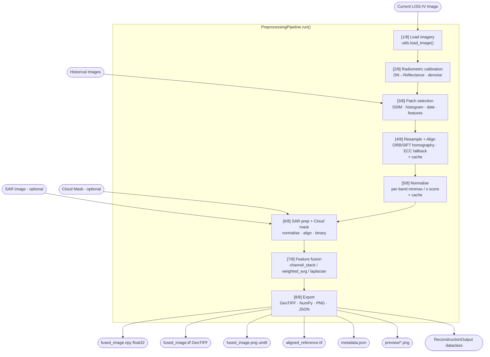

# LISS-IV Cloud Removal — Data Fusion & Preprocessing Pipeline

**ISRO Bharatiya Antariksh Hackathon** | Module: Data Fusion & Preprocessing

---

## Architecture



---

## Preprocessing Workflow

| Step | Module | Input → Output |
|------|--------|---------------|
| Load | `utils.py` | file path → `(ndarray, meta dict)` |
| Calibration | `calibration.py` | raw DN → float32 reflectance |
| Patch selection | `patch_selector.py` | historical dir → best reference path |
| Alignment | `alignment.py` | source, target → warped source + RMSE |
| Resampling | `resampling.py` | different-res arrays → common grid |
| Normalisation | `normalization.py` | any float → [0,1] per-band |
| SAR | `sar_handler.py` | SAR GeoTIFF → normalised float32 |
| Cloud mask | `cloud_mask.py` | mask.png / mask.tif → binary float32 |
| Fusion | `fusion.py` | current + historical [+ SAR] → fused tensor |
| GeoTIFF export | `geotiff_export.py` | ndarray + meta → analysis-ready TIF |
| Package export | `exporter.py` | all arrays → structured output directory |
| Metadata | `metadata.py` | pipeline state → `metadata.json` |
| Preview | `preview.py` | normalised arrays → PNG visualisations |
| Cache | `cache.py` | expensive intermediates → `.cache/` |
| Progress | `progress.py` | step context manager → `[N/8]` log lines |

---

## Folder Structure

```
backend/
  preprocessing/
    calibration.py      – DN→Reflectance, histogram match, denoise
    alignment.py        – ORB/SIFT homography + ECC fallback
    resampling.py       – Rasterio warp.reproject (nearest/bilinear/cubic)
    normalization.py    – Per-band minmax / z-score
    fusion.py           – channel_stack / weighted_average / laplacian_pyramid
    patch_selector.py   – Multi-metric historical image scorer
    sar_handler.py      – Sentinel-1 SAR load + normalise + align
    cloud_mask.py       – Cloud Detection module adapter (Task 2)
    geotiff_export.py   – CRS-preserving GeoTIFF export (Task 3)
    exporter.py         – Reconstruction package builder (Task 4)
    interfaces.py       – ReconstructionInput / ReconstructionOutput (Task 1)
    metadata.py         – Rich metadata accumulator (Task 5)
    progress.py         – Numbered step logger with timing + RAM (Task 6)
    cache.py            – SHA-256 file-hash intermediate cache (Task 7)
    pipeline.py         – Main orchestrator
    preview.py          – Streamlit preview image generator
    utils.py            – Shared I/O helpers
  data/
    current/            – Input: current cloudy LISS-IV image
    historical/         – Input: cloud-free historical images
    sar/                – Input: optional SAR GeoTIFF
    output/             – All pipeline outputs
  tests/
    test_alignment.py
    test_calibration.py
    test_fusion.py
    test_metadata.py
    test_normalization.py
    test_resampling.py
    test_utils.py
    integration_test.py – End-to-end pipeline validation (Task 13)
  configs/
    pipeline_config.yaml
  notebooks/
    01_preprocessing_demo.ipynb
cli.py                  – Command-line interface (Task 8)
main.py                 – FastAPI application
requirements.txt
Dockerfile
```

---

## Outputs

### Per-run reconstruction package

```
output/reconstruction/{sample_id}/
    current.png                 – uint8 RGB current image
    historical.png              – uint8 RGB historical reference
    aligned_reference.png       – uint8 RGB aligned historical
    fused_image.png             – uint8 RGB fused preview
    fused_image.npy             – float32 (H,W,C) primary model input
    fused_image.tif             – GeoTIFF float32 with CRS + transform
    cloud_mask.png              – binary mask (optional)
    metadata.json               – full rich metadata
    preview/
        overlay.png             – 50/50 alpha blend
        difference.png          – JET heatmap of abs difference
        fusion_preview.png      – fused RGB preview
```

### metadata.json schema

```json
{
  "image_id": "lissiv_20230615",
  "resolution": [5.8, 5.8],
  "CRS": "EPSG:4326",
  "bands": 3,
  "historical_image_used": "historical/20230601.tif",
  "registration_error": 1.24,
  "registration_rmse": 1.24,
  "feature_matches": 312,
  "ssim_score": 0.87,
  "histogram_score": 0.92,
  "normalization": { "method": "minmax", "band_stats": [...] },
  "fusion_method": "channel_stack",
  "SAR_used": false,
  "cloud_mask_used": false,
  "processing_time": 9.21,
  "pipeline_version": "1.0.0",
  "warnings": []
}
```

---

## Quickstart

### Python

```python
from backend.preprocessing.pipeline import PreprocessingPipeline
from datetime import date

result = PreprocessingPipeline().run(
    current_path="backend/data/current/lissiv.tif",
    historical_dir="backend/data/historical/",
    sar_path="backend/data/sar/s1.tif",        # optional
    cloud_mask_path="backend/data/mask.png",   # optional
    current_date=date(2023, 6, 15),
    sample_id="scene_001",
)

# Typed outputs
print(result.reconstruction_output.fused_tif)   # Path to GeoTIFF
print(result.reconstruction_input.spatial_shape) # (H, W)
print(result.metadata["processing_time"])         # seconds
```

### Reconstruction model integration

```python
import numpy as np
from backend.preprocessing.interfaces import ReconstructionInput

# The pipeline returns this directly
ri: ReconstructionInput = result.reconstruction_input

# Arrays ready for the model
current  = ri.current_image   # float32 (H,W,C) [0,1]
fused    = ri.fused_image      # float32 (H,W,C_fused)
mask     = ri.cloud_mask       # float32 (H,W) binary, or None

# uint8 PNG alternative
from PIL import Image
img = Image.open(str(result.reconstruction_output.current_png))
```

---

## CLI Usage

```bash
# Minimal
python cli.py --current data/current/img.tif --historical data/historical/

# Full
python cli.py \
    --current    backend/data/current/img.tif \
    --historical backend/data/historical/ \
    --sar        backend/data/sar/s1.tif \
    --cloud-mask backend/data/mask.png \
    --output     backend/data/outputs/ \
    --date       2023-06-15 \
    --sample-id  scene_001 \
    --verbose
```

---

## API Usage

### Start server
```bash
uvicorn main:app --host 0.0.0.0 --port 8000 --reload
```

### `POST /preprocess`

```bash
curl -X POST http://localhost:8000/preprocess \
  -F "current_image=@current.tif" \
  -F "historical_images=@hist1.tif" \
  -F "historical_images=@hist2.tif" \
  -F "sar_image=@s1.tif" \
  -F "cloud_mask=@mask.png" \
  -F "current_date=2023-06-15" \
  -F "sample_id=scene_001"
```

**Response:**
```json
{
  "status": "success",
  "processing_time": 9.2,
  "output_directory": "backend/data/output/...",
  "paths": {
    "fused_png": "...",
    "fused_tif": "...",
    "fused_npy": "...",
    "metadata": "...",
    "preview": "...",
    "aligned_reference_tif": "...",
    "current_png": "...",
    "cloud_mask_png": null
  },
  "metadata": { ... },
  "warnings": []
}
```

Other endpoints:
- `GET /health` — liveness check
- `GET /outputs/{filename}` — serve any output file
- `DELETE /cache` — clear intermediate cache
- `GET /cache/stats` — cache size and entry count

---

## Configuration

`backend/configs/pipeline_config.yaml`:

```yaml
calibration:
  gain: 0.0001          # DN → Reflectance scale factor
  noise_reduction:
    method: gaussian    # gaussian | median | bilateral

alignment:
  detector: orb         # orb | sift
  ecc_fallback: true    # ECC when feature matching fails

normalization:
  method: minmax        # minmax | meanstd

fusion:
  method: channel_stack # channel_stack | weighted_average | laplacian_pyramid

# Band selection (1-based, LISS-IV convention)
bands:
  red: 3
  green: 2
  blue: 1
  # nir: 4

# Intermediate cache
cache:
  dir: .cache
  max_age_seconds: 604800  # 7 days
```

---

## Integration Guide

### Cloud Detection module → Preprocessing

Your teammate's cloud detection module should output either:
- `mask.png` — uint8 grayscale, 255 = cloud, 0 = clear
- `mask.tif` — GeoTIFF, 1 = cloud, 0 = clear

Pass the path as `cloud_mask_path` to `pipeline.run()` or `--cloud-mask` in the CLI. The preprocessing module handles loading, resizing to the current image grid, and validation automatically. If the file is missing or unreadable, the pipeline continues cleanly without the mask and logs a warning.

### Preprocessing → Reconstruction model

The pipeline outputs a `ReconstructionInput` dataclass:

```python
@dataclass
class ReconstructionInput:
    current_image: np.ndarray    # float32 (H,W,C) [0,1]
    historical_image: np.ndarray # float32 (H,W,C) [0,1]
    fused_image: np.ndarray      # float32 (H,W,C_fused) [0,1]
    cloud_mask: np.ndarray|None  # float32 (H,W) binary
    sar_image: np.ndarray|None   # float32 (H,W,C_sar)
    metadata: dict
```

The fused tensor channel layout when using `channel_stack`:
- Channels 0–2: current image RGB
- Channels 3–5: aligned historical RGB
- Channels 6+: SAR bands (if used)

### Preprocessing → Streamlit Dashboard

All preview images are saved to `output/reconstruction/{sample_id}/preview/`. Load them directly:

```python
import cv2
overlay = cv2.imread("preview/overlay.png")
diff    = cv2.imread("preview/difference.png")
fusion  = cv2.imread("preview/fusion_preview.png")
```

---

## Running Tests

```bash
# Unit tests (60 tests)
python -m pytest backend/tests/ -v --ignore=backend/tests/integration_test.py

# Integration tests (29 tests — runs full pipeline)
python -m pytest backend/tests/integration_test.py -v

# All 89 tests
python -m pytest backend/tests/ -v
```

---

## Docker

```bash
docker build -t lissiv-preproc .
docker run -p 8000:8000 \
  -v $(pwd)/backend/data:/app/backend/data \
  lissiv-preproc
```

---

## Troubleshooting

| Symptom | Cause | Fix |
|---------|-------|-----|
| `CRSError: Missing src_crs` | Image has no embedded CRS | Pipeline continues; resampling uses transform-only mode |
| `AlignmentError` | Source and target share no features | ECC fallback triggers automatically; check image overlap |
| `ModuleNotFoundError: rasterio` | Dependencies not installed | `pip install -r requirements.txt` |
| Slow on large images | Laplacian pyramid fusion selected | Switch `fusion.method` to `channel_stack` or `weighted_average` |
| Stale cache results | Input files changed, cache not invalidated | `python -c "from backend.preprocessing.cache import PipelineCache; PipelineCache().clear_all()"` or `DELETE /cache` |
| Cloud mask shape mismatch | Mask at different resolution | Automatically resized with nearest-neighbour interpolation |

---

## Performance

Target: 1024×1024 image in **10–20 seconds on CPU**.

Key levers:
- `alignment.max_features`: reduce to 1000 to speed up ORB detection
- `resampling.method: nearest` is ~2× faster than `cubic`
- `fusion.method: channel_stack` is fastest; `laplacian_pyramid` is slowest
- Second run on same inputs hits the `.cache/` and skips alignment + normalisation entirely
